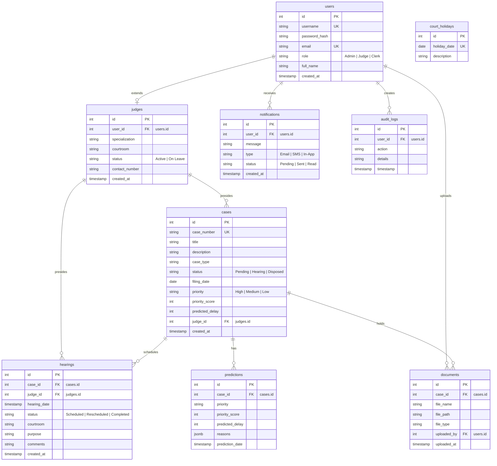

# Entity Relationship (ER) Diagram

This document details the PostgreSQL database schema model. The tables are normalized to 3NF, linking accounts, court cases, hearings, documents, notifications, and audit trails.

---

## 1. ER Diagram (Mermaid Visualizer)

---

## 2. Table Schemas & Relational Keys

1. **`users` Table**: Base accounts. Holds login credentials, passwords hashed with bcrypt, and role privileges.
2. **`judges` Table**: Extends `users` through a `1:1` foreign key mapping (`user_id`). Defines the judge's courtroom, active availability status, and contact phone numbers.
3. **`cases` Table**: Stores case metadata, current legal status, and coordinates assignment to a presiding judge (`judge_id`). Contains cached fields for priority class and delay predictions returned from the AI.
4. **`hearings` Table**: Roster slot entries. Coordinates cases with judge availability. Linked `1:N` from cases and `1:N` from judges.
5. **`predictions` Table**: Main historical record logs of every AI prediction run for a case (retains a JSON list of analysis reason tags).
6. **`documents` Table**: Metadata of legal filings, pleadings, and affidavits uploaded via Multer, linking files to their respective case ID.
7. **`notifications` Table**: Inbox log containing SMS, Email, and In-App alerts pushed to court clerks, judges, and admins.
8. **`audit_logs` Table**: System security ledger tracking authentication logins, database entries, edits, and deletions.
9. **`court_holidays` Table**: Closed calendar dates, referenced by the scheduling scheduler algorithm.
